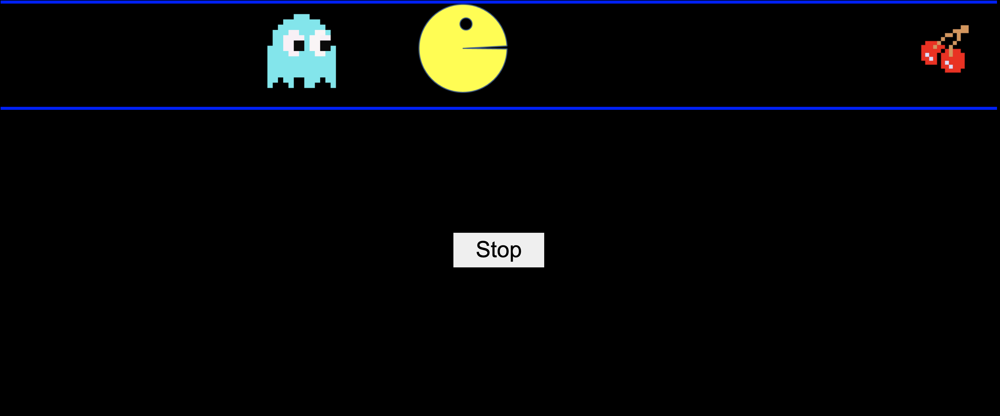

# Pacman
 This is a simple project built as an exercise for MITxPro, the objective of this project is to show an animation of Pacman using just JavaScript, HTML and some assets.

 ## Starting

To execute this project you need to clone this repository and open the index.html file in your browser. Here is how you can do it:

 - Clone this repo using
  ```dash
  git clone https://github.com/EffrenAnthony/Pacman
  ```
- Open in your browser or drag and drop the index.html file located in the root of this project
```dash
~${HOME}/index.htmlPacman/index.html
```
- This is how the project should look


## Usage

You can see the entire source code of this project in this repository. To see it you can use the IDE or code editor of your preference and onpen this project.

Also you can make a pull request if you want to contribute with this project.


## Licence
[MIT](https://choosealicense.com/licenses/mit/)